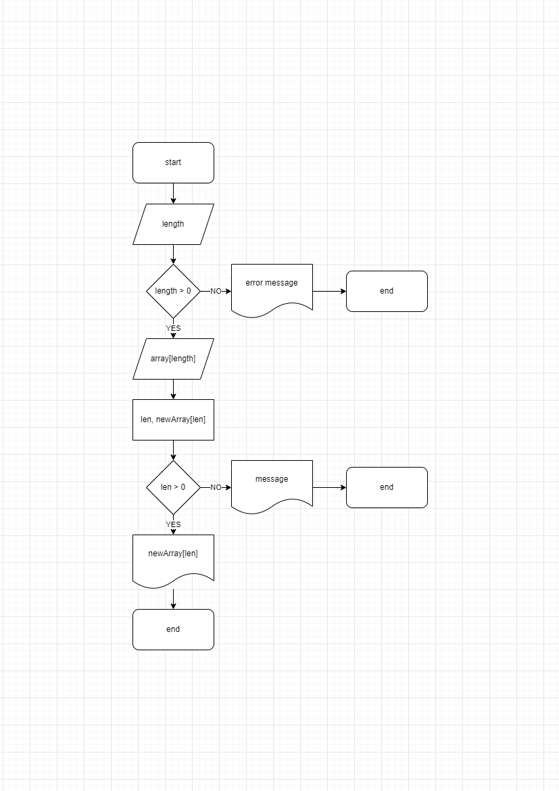
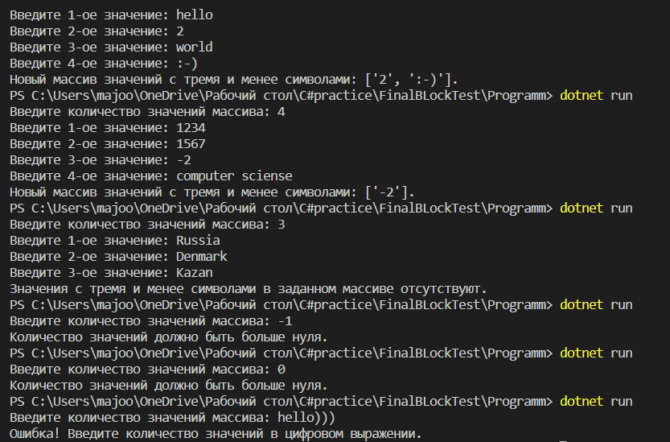

## Задача

*Написать программу, которая из имеющегося массива строк формирует новый массив из строк, длина которых меньше, либо равна 3 символам. Первоначальный массив можно ввести с клавиатуры, либо задать на старте выполнения алгоритма. При решении не рекомендуется пользоваться коллекциями, лучше обойтись исключительно массивами.*

## Описание программы

Программа представляет собой консольное приложение, написанное на языке C# с использованием фреймворка .Net версии 6.0.406. Она позволяет пользователю задать количество значений массива, заполнить массив строковыми значениями, отфильтровать их, оставив только имеющие длину не более трех символов, и вывести новый массив с отфильтрованными значениями.

## Функции

- **GetLength():** Функция запрашивает у пользователя количество значений массива и возвращает это значение в виде целого числа.

- **FillArray(int length):** Функция запрашивает у пользователя значения каждого элемента массива и возвращает массив типа string. Количество запрашиваемых значений определяется параметром length, переданным в функцию. 

- **NewArrayLength(string[] array):** Функция определяет количество элементов в массиве array, длина которых меньше или равна 3 символам, и возвращает это количество в виде целого числа.

- **FillNewArray(string[] array, int length):** Функция создает новый массив newArray и заполняет его значениями из массива array, длина которых меньше или равна 3 символам и количество которых определяется параметром len, полученным из прошлой функции. Функция возвращает новый массив newArray.

- **PrintNewArray(string[] array, int length):** Функция выводит на экран содержимое массива newArray. Если массив пустой, то выводится соответствующее сообщение.

- В блоке **try** происходит вызов функций в соответствующей последовательности, исключая возможные ошибки. В случае возникновения ошибки будет выведено сообщение.

## Блок-схема алгоритма работы программы

## Использование программы
Cледуйте инструкциям, которые будут выведены на экран во время выполнения программы. \
Основные шаги использования программы:

1. Введите количество значений массива.

2. Введите значение для первого элемента массива.

3. Введите значение для второго элемента массива и т.д.

4. Программа автоматически создаст новый массив, содержащий только значения с длиной строки меньше или равной 3 символам (если таковые будут) и выведет содержимое нового массива (или сообщение о его отсутствии) на экран.

## Пример использования
